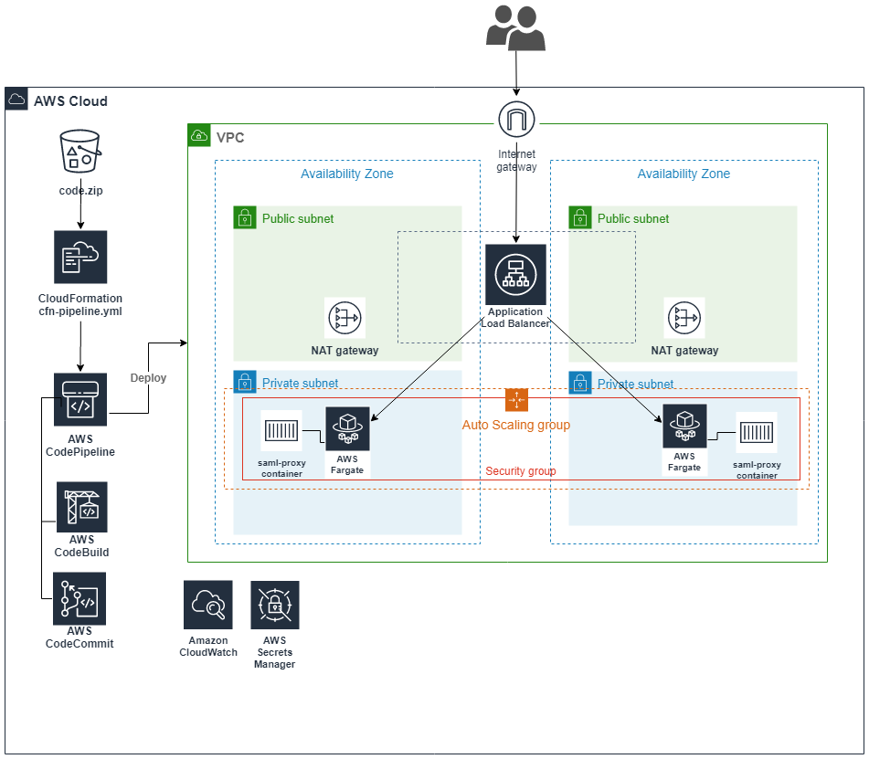

# saml-proxy: A customized SATOSA SAML-SAML proxy on Fargate

This project contains contains code to automate the deployment of a SAML proxy that is configured to "Proxy" SAML assertions between an identity provider and the AWS Service Provider. 

Out of the box, the SAML proxy is configured to support AppStream customers that need to convert the format of the subject (NameID) from `username@domain.com` to `DOMAIN.COM\username` when their IdP cannot support this transformation. This specific transformation was needed for a customer that uses an MIT Kerberos cross-realm trust that is case-sensitive and would only work with the `SAMAccountName` format, but their `IdP` could only send the `NameID` in `UserPrincipalName` format with a lowercase domain.  Though this is likely an edge case, the proxy could also be configured to support a variety of other scenarios, such taking a a SAML attribute receivedd from the source IdP and passing that back to the AWS SP as the `NameID`, or enriching the response assertion by injecting addtional attributes from an external source (i.e. LDAP)

The saml-project project uses [SATOSA](https://github.com/IdentityPython/SATOSA), an identity proxy application largely based on pysaml2. Saml-proxy includes a customized SATOSA SAML Frontend plugin that accepts unsolicited requests as well as a custom SATSOA microservice that can parse `UserNamePrincipal` (`username@domain.com`) formatted `NameID` and convert it to `SAMAccountName` (`DOMAIN.COM\username`) format with (optionally) an uppercase domain. **The custom SAML Frontend plugin and microservice are NOT part of the SATOSA code base.** The code for these customzations can be found in `satosa/micro_services` and `satosa/frontends` folders of this repo. 


# Key Features
- Fully automated - The setup of Saml-Proxy is full automated. Simply zip up the contents of this repo and upload to `code.zip` in an S3 bucket, then run the `cfn-pipeline.yml` template. A CodePipeline project is created that handles the rest. Details below.
- Minimal infrastructure - The app runs as a Fargate task behind an Application Load Balancer, within its own isolated VPC. 
- Simple setup - Configured out of the box to proxy requests to the AWS SP from your IdP. 
- Secure - The private key used for SAML Metadata is automatically generated and securely stored in Secrets Manager. 
- Customizable - After deploying the solution, you can connect to the CodeCommit Repo and further customize the SATOSA configuration as desired. Can be used with other SPs as well as a SAML-OIDC or SAML-Social Login solution. See [SATOSA docs](https://github.com/IdentityPython/SATOSA) for details. Commit changes to the repo and CodePipeline will automatically re-deploy.

Architecture:



## Prerequisites
- An SAML2 Identity Provider (IdP) that will be used for authentication. Once installed, you will need to share the SAML Proxy's metadata with your IdP.
- An S3 bucket to store the cloudformation templates
- The appropriate IAM permissions to create all required infrastructure resources AND access the S3 bucket.
- An SSL certificate provisioned in AWS Certificate Manager - This will be used on the HTTPS listener of the Load Balancer
- (Optional) A Route53 hosted zone in the account, if you want to automatically create a resource record for the SAML Proxy. 

## Setup instructions

| :information_source: &nbsp;&nbsp; Important| 
|:-|
| During the deployment, the pipeline will automatically create a self-signed certificate and private key for the SP and IdP metadata and store them in Secrets Manager. If you want to provide your own certificate, you can edit the secrets in Secrets Manager after the initial deployment, then stop any running tasks in the ECS service.  | 


1. Create a certificate in AWS Certificate Manager, if you haven't yet

2. If you want to automatically create a DNS Record in Route53, ensure you already have a Hosted Zone created.

3. Download `code.zip` (an archive of the repo located in the root folder) and upload it to the S3 bucket

4. Create an S3 bucket and copy the files in the cloudformation directory into it

5. Download `cfn-templates/cfn-pipeline.yml`

6. In the CloudFormation console, [go to Create Stack](https://console.aws.amazon.com/cloudformation/home?region=us-east-1#/stacks/create/template), select **Upload a template file** and browse to the `cfn-pipeline.yml` template you downloaded in the previous step. Click Next.

7. For **Stack Name**, give the stack a meaningful name (i.e. saml-proxy). In the Parameters section, provide values for each paramter and click Next.

    **Note:** If you don't have a Route53 Hosted Zone in the account or use an external DNS provider, skip the **Route53 DNS** section.

8. At the **Configure stack options** page, scroll to the bottom and click Next.

9. At the **Review options** page, scroll to the bottom and check the box next to **I acknowledge that WS cloudFormation might create IAM resources** and click **Create stack**. 

10. In the Cloudformation console, you can monitor the progress of the stack deployment. When the deployment is complete, You can click the **Outputs** tab, then click the link next the **PipelineUrl** to be taken to the CodePipeline project.

11. In CodePipeline, watch the progress as the deployment. When the deployment completes, you can go to the Urls of the load balancer to view and download the SP and IdP metadata.

## Post-Deployment Setup
Once deployed, the SAML proxy has several importan URLs that will be used:
- `https://[YourSamlProxyDns]/idp` - Contains the metadata for the IdP side of the proxy. This is usually shared with your target SP.
- `https://[YourSamlProxyDns]/Saml2/sp` - Contains the metadata for the SP side of your metadata provider. This is usually shared with your source IdP
-`https://[YourSamlProxyDns]/Saml2/unsolicited?providerId=[ProviderEntityId]&target=[TargetUrl]` - This is the URL used to initiate a request. This is typically used when the SP does not support an SP-initiated request to the IdP, such as AWS.

The SAML Proxy is preconfigured to support federated authentication to AWS (and AppStream). However, you will need to perform a few steps to connect it with your IdP and your AWS Account. The general process is as follows:

1. Download the SAML proxy's SP metadata at `/Saml2/sp` and share it with your IdP. It is expected that your IdP will return the required AWS attributes (i.e. `RoleName`, `RoleSessionName`)
2. Download the SAML proxy's IdP metadata at `/idp`. In your AWS account,  create an [IAM SAML Identity Provider](https://docs.aws.amazon.com/IAM/latest/UserGuide/id_roles_providers_create_saml.html) and make sure any Roles that will be used have the appropriate trust policy in place, per the [documentation](https://docs.aws.amazon.com/IAM/latest/UserGuide/id_roles_providers_enable-console-saml.html).
3. In a web browser, use the `/Saml2/unsolicited` URL to initiate an authentication request with the SP's entity ID included, i.e. `https://[YourSamlProxyDns]/Saml2/unsolicited?providerId=urn:amazon:webservices`

Here is a brief description of the authentication flow:
```
-> /Saml2/unsolicited 
-> SAML Proxy SP - redirect with AuthnRequest to source IdP 
-> Authenticate at IdP 
-> redirect with assertion to /Saml2/acs 
-> SAML Proxy IdP generates custom assertion
-> redirect with SAML Proxy IdP assertion to AWS SP
```

## Components
The project consists of 3 major sets of components:

### SATOSA Config and Modules
Any SATOSA-related code and configuration files  located in the `satosa/` folder:

- **satosa/frontends** - Custom frontend plugins. The `saml2_custom.py` file contains a customized frontend that can handle unsolicited requests and custom RelayState parameters.

- **satosa/micro_services** - Custom microservices that can be used to process and customize assertions. The `custom_nameid.py` file is a custom microservice that checks if `NameId` (subject) is in `UserPrincipalName` format and can convert it to `SamAccountName` format. It can also convert the domain to uppercase.

- **satosa/config** - Configuration files for SATOSA and its plugins. Additional details about files within this directory are below:
    - **proxy_conf.yaml** - The main parameters that SATOSA uses for configuration. This includes specifying the backend, frontend, and microservice configurations that are used, as well as logging and attribute mappings.

    - **internal_attributes.yaml** - Maps SAML attributes to names that will are used internally by SATOSA. This can also be used to map an Attribute returned by an IdP to the NameID when passing an assertion to the target SP. The SATOSA docs have more details on this.

    - **attributemaps** - Contains the attribute mappings that are used to translate the SAML attributes to "internal" attribtues used by Satosa. The `custom.py` file defined AWS-specific attributes like `Role` and `RoleSessionName`.

    - **plugins/backends/saml2_backend.yaml** - The configuration for the SAML Proxy's SP. Any target IdP's metadata is defined here. Your IdP's metadata Url is automatically added to this configuration file through an environment variable specified at runtime.

    - **plugins/backends/saml2_frontend.yaml** - The configuration for the SAML Proxy's IdP. The configuration specifies the custom front plugin (`satosa.frontends.custom.saml2_custom.SAMLUnsolicitedFrontend`). For unsolicited requests, any RelayState endpoints that should be allowed are defined in the `allowed_relay_state_urls` parameter. Any SP's metadata is also defined here. The AWS SP metadata Url is included here by default.

    - **plugins/microservices/custom_nameid.yaml** - The settings used by `custom_nameid.py` microservice (see `satosa/micro_services` above for more details). The microservice's class is specified in this file (`satosa.micro_services.custom.custom_nameid.ConvertUpnToSamAccountFormat`) and `domain_to_upper` is set to `true` by default in the config to convert the domain name to uppercase.


### CloudFormation Templates
CloudFormation templates are located in the `cloudformation` directory. Below are the templates, listed in order of deployment:
1. **cfn-pipeline**: Main template used to deploy the base CodePipeline project, code repository with code, ECR repo, and secrets. Also takes in SAML Proxy settings that will be used throughout the deployment.

2. **cfn-vpc**: Creates the VPC, subnets, and NAT gateways. This is deployed by CodePipeline in the Deploy stage.

3. **cfn-ecs-fargate-cluster**:  Deploys the ECS cluster, load balancer + listener and target groups, ECS service, and task definition. It also creates an S3 bucket to store the load balancer access logs. This is deployed by CodePipeline.


### CodeBuild Buildspecs
The buildspec files contain scripted operations needed when restoring the site from backup files. More details are below:
1. **buildspec-buildimage**: Builds the docker image using `docker/Dockerfile`. The Dockerfile pulls the latest SATOSA image from Docker Hub, adds the files in `satosa/config` to `/etc/satosa/config` and modifies to `CMD` to run `docker/write_metadata_key.sh` at container startup. This script will write the PRIVATE_KEY and METADATA_CERTIFICATE envrionment variables to files prior to starting the SATOSA server.

2. **buildspec-generatekeys**: Checks if the SecretsManager secrets that store the metadata private key and certificate contain values and, if not, generates a private key and certificate and stores them in the Secrets Manager Secrets. If the secrets already contain values, then this buildpec does nothing.

3. There is also a CodeBuild project and Buildspec built into the CodePipeline template named `GenerateClusterParameters`. This Buildspec is used to prepare a JSON file containing the parameter names and values that will be used as input to the `cfn-ecs-fargate-cluster` template. Though these paramters can be passed into [CodePipeline CloudFormation Actions](https://docs.aws.amazon.com/AWSCloudFormation/latest/UserGuide/continuous-delivery-codepipeline-action-reference.html) dynamically using `ParameterOverrides`, there is a 1000 character limit and so this project works around that. Also, I couldn't find a way to use [`Fn::GetParam`](https://docs.aws.amazon.com/AWSCloudFormation/latest/UserGuide/continuous-delivery-codepipeline-parameter-override-functions.html) to pass multiple input parameters into a single Parameter (i.e. ClusterSubnets). Because it's tightly coupled to the Pipeline, I opted to write this buildspec into the pipeline template itself, but might move it into the `buildspecs` folder later.


## Customization
During deployment, the code package uploaded to S3 is extracted into an AWS CodeCommit repository. You can connect to this repository and make changes to the files above, then commit to the master branch. 

Anytime a commit to the repo occurs, it will automatically trigger CodePipeline project to apply any changes. This includes automatically rebuilding the container image, updating any CloudFormation stacks, and updating the ECS Service and Task Definition.

The exception to this is if you want to make changes to the pipeline itself, via the cfn-pipeline.yml template used initially to deploy the initial stack. Any changes to this will require manually updating the stack.

| :information_source:  &nbsp;&nbsp; Important| 
|:-|
| If modifying the CloudFormation templates, remember that the behavior/rules of CloudFormation still apply. If extensive customization is required, it is recommended that you setup a copy of this project for dev/test.  | 


## Uninstall/Cleanup
| :warning: | Delete the stacks in the order listed below. Deleting cfn-pipeline.yml will remove the role used to deploy the other stacks. | 
|-|:-|

Most of this solution can be uninstalled by deleting the associated CloudFormation stacks.
1. If it exists, delete the `[StackName]-fargate` stack.
2. If it exists, delete the `[StackName]-vpc` stack.
3. Delete the stack that was created with `cfn-pipeline.yml`


Note that there are few artifacts that will cause `DELETE_FAILED` on the stacks. They will be left behind and must be cleaned up manually:
1. The ECR repository (named `[StackName]-image`).
2. The S3 bucket and code.zip file that was uploaded to it.
3. The artifacts S3 bucket created by the pipeline (`[StackName]-artifactbucket-randomstring`).
4. The load balancer logs S3 bucket created in the fargate stack (`[StackName]-fargate-loadbalancerlogsbucket-randomstring`)

## Possible Future Enhancements
If time were infinite:
- Enhance the deployment of updated container images - Blue/Green deployment or something similar.
- Load testing and scale out - I didn't have time to test autoscaling. The load balancer is configured with sticky sessions.
- PR to put customizations into SATOSA so they don't need to be injected into the container image.
- ?

## Helpful Links
- SATOSA on Github: https://github.com/IdentityPython/SATOSA
- SATOSA container on Docker Hub: https://hub.docker.com/r/satosa/satosa
- SATOSA microservice development: https://github.com/IdentityPython/SATOSA/wiki/Anatomy-of-a-response-micro-service
- pysaml2 docs: https://pysaml2.readthedocs.io/en/latest/
- ECS CloudFormation Template: https://github.com/awslabs/aws-cloudformation-templates/tree/master/aws/services/ECS

